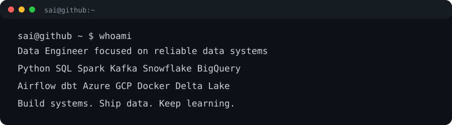

<table><tr>
<td valign="top"></td>
<td valign="top"></td>
</tr></table>

# Sai Kiran Anugula

**Data Engineer | Python • SQL • Spark • Cloud • Analytics**

Building reliable data pipelines, analytics systems, and cloud-ready data platforms.

 

---

### `sai@github ~ $ whoami`

**Data Engineer focused on building reliable data systems**

## 🧰 Tech Stack

**Data Engineering**  
Python · SQL · ETL/ELT · Data Ingestion · Data Transformation · Data Modeling · Data Quality

**Big Data & Streaming**  
Apache Spark · PySpark · Kafka · Batch Processing · Real-Time Processing · Partitioning

**Warehousing & Lakehouse**  
Snowflake · BigQuery · PostgreSQL · dbt · Delta Lake · Apache Iceberg · Dimensional Modeling

**Cloud & DevOps**  
Azure · GCP · Docker · Linux/Bash · Git · Jupyter

## 🚀 Featured Project

### MoteIQ

Motel analytics platform built around ingestion, data cleaning, SQL analytics, and interactive reporting.

---

### `sai@github ~ $ git log --oneline --focus`

**Learn → Build → Measure → Improve**

